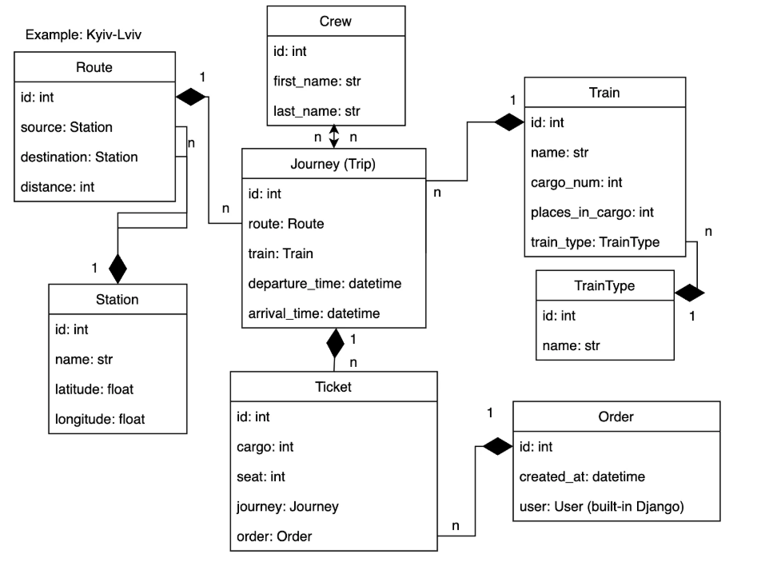

# 🚅Train Station API

## Overview
Train Station API is a RESTful web service 
built using Django REST Framework (DRF) 
that provides functionality to manage stations, 
routes, trains, crew members and orders, ensuring 
efficient operation and data processing in real time. 
This project is designed to serve as a backend solution 
for railway systems, offering endpoints to query and update 
real-time data about stations, trains, and passengers.
---

##  ✨Features
  - **CRUD Operations** for Train Stations, Routes, Trips, Orders, Crews.
  - **Booking System**: Reserve and manage tickets for specific routes.
  - **Authentication**: Secure access to endpoints using token-based authentication (JWT).
  - **Pagination and Filtering**: Efficient querying of large datasets with customizable filters.
  - **API Documentation**: Interactive API documentation using Swagger and ReDoc.
---

## 🛠️Technologies Used
- Python 3.12
- Django 5.1
- Django REST Framework
- PostgreSQL
- Docker & Docker Compose
- Poetry (dependency management)
- JWT Authentication
- Swagger/Redoc
---

##  🗄️Database Structure


---
## 🚀 Installation

### Local Setup

1. **Clone the repository:**
   ```bash
   git clone https://github.com/KKvladys/train-station-api.git
   cd train-station-api
   ```
2. **Create and activate a virtual environment:**
   ```bash
   python -m venv venv
   source venv/bin/activate  # On macOS/Linux
   venv\Scripts\activate    # On Windows
   ```
3. **Install dependencies:**
   ```bash
   pip install poetry
   poetry install
   ```
4. **Create a `.env` file:**
   ```bash
   cp .env.sample .env
   # Edit the .env file with your configurations
   ```
5. **Apply database migrations:**
   ```bash
   python manage.py migrate
   ```
6. **Create a superuser:**
   ```bash
   python manage.py createsuperuser
   ```
7. **Load Data:**
   ```bash
   python manage.py loaddata data.json
   ```
8. **Run the development server:**
   ```bash
   python manage.py runserver
   ```

### 🐳Running with Docker

1. **Clone the repository:**
   ```bash
   git clone https://github.com/KKvladys/train-station-api.git
   cd train-station-api
   ```
2. **Create a `.env` file:**
   ```bash
   cp .env.sample .env
   # Edit the .env file with your configurations
   ```
3. **Build and run containers:**
   ```bash
   docker-compose up --build
   ```

---
## ⚙️Environment Variables

This project uses environment variables for configuration. 
A template file .env.sample is provided to guide you in setting 
up these variables. Before running the project, create a .env file 
based on the template and provide the required values.

```
# Database settings
POSTGRES_HOST=db
POSTGRES_PORT=5432
POSTGRES_DB=train_station_db
POSTGRES_USER=train_user
POSTGRES_PASSWORD=strong_password

# Django settings
SECRET_KEY=your_secret_key
DEBUG=True
ALLOWED_HOSTS=*
```
---
## ✅Testing

The project includes unit tests for models, serializers, 
views, and custom logic to ensure reliable functionality.

To run unit tests, use the following command:

```bash
# Local environment
python manage.py test  
# or
# Docker environment
docker-compose exec app make test
```


